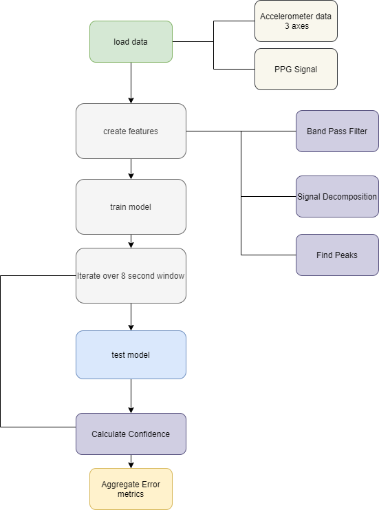

# AI for Healthcare

Note:
The projects in this repository are for academic purposes, none of the models trained are ready to be deploy in a production environment.

Programming Language:
-  Python >=3.6

------------
## Motion Compensation

Develop a Pulse Rate Algorithm using type wrist ppg and accelerometer signals.

Dependencies:
- sklearn
- numpy
- seaborn

### Data Description:
The data contains signals recorded from  wrist devices when the subjects were doing intensive exercise, the signals are contaminated by intentional/unintentional movements of the arm.

Each file contains the following signals:
- 3-axis accelerometer signal 
- PPG signal
     
### Algorithm Description:

#### How the algorithm works:

- Load data: Load to memory the PPG signal and accelerometer data from 12 subjects.

- Create Features:
    - Band Pass Filtering: Attenues certain frequencies in a specific range. In this case we apply a range between 40 - 240 BPM. It removes some motion artifacts.

    - Signal Decomposition: It descompose our signal using Fast Fourier transformation. Then the components related to noise and interference are removed. The final signal can be reconstructed base on the components that were not removed.

    - Find peaks: Detect the peaks in our signal that was bandpassed. 

- Train Model: the dataset is splitted assigning 20% of the data for test and 80% for training.

- Test Model: The model is tested by running the algorithm over the whole dataset.

- Calculate confidence: The the confidence is calculate base on the sum of the frequency spectrum near the pulse rate estimate and dividing it by the sum of the entire spectrum. This output is produce every two seconds.

- Agregate Error metrics: Computes the MAE at 90% availability. 

#### The specific aspects of the physiology that it takes advantage of
- Wrist Type PPG signal: The ppg signal can be use to measure the Heart rate of a subject, this signal is collected from a non invasive method where the signal measure the volumetric variation of the blood circulation.

- Accelerometer signal:  Measures the accelaration forces in different axis, for our project we need to differentiate between unintentional movements thaht generates noise in ur signal to predict the next value of the heart rate.

#### Description of the algorithm outputs

#### Caveats on algorithm outputs
The dataset was build base on the data collected of 12 subjects performing intensive physical exercise (PPG, Accelerometer signal), whose activity is similar. This similarity could lead the algorithm to perform better than it really is if it tested in other subjects whose activity differ from the data that was used. 

#### Common failure modes
- The PPG signal is vulnerable to motion artifacts such as the device not being well-attach to the wrist of the subject. It might add aditional noise to the signal.
- The algorithm was developed to perform well under normal conditions, the algorithm has not been tested under water, high altitude or other extreme condition.

####  Algorithm Performance:

- The algorithm selected was RandomForest because it get the lowest measures of error in comparison to Ridge Regression and Support Vector Machine which exceeds MAE of 15

Model parameters: 

    * Random Forest Parameters:
        - max_depth = 15 
        - estimators = 350

    * Train test split
        - test_percentage = 0.2
        - train_percetange = 0.8

- The performance was given by using the Mean absolute Error.

- The model performs obtaining a `MAE` of **9.01** over the entire dataset comparing a 2 seconds ground truth.

------

## Pneumonia detection from CHEST X-ray
Analyze data from the NIH Chest X-ray Dataset and train a CNN to classify a given chest x-ray for the presence or absence of pneumonia. 

Dependencies:
- numpy
- matplotlib
- keras

### Algorithm Description 

#### 1. General Information

**Intended Use Statement:** 

 For assisting the radiologist in the detection of Pneumonia using x-rays.

**Indications for Use:**

- Emergency workflow re-prioritization.
- This algorithm is intended for patients (women and men) between the ages of 20 to 60 years old whose X-ray has been taken in PA, AP position.
- The patients can have zero or more disease, specifically Atelectasis, Edema and Infiltration.

**Device Limitations:**

- The algorithm will take more time at inference if it is not run in a GPU.
- Patients over 60 years old would cause the algorithm output not valid results.

------

## Patient Selection 
Analyze patients EHR data to predict if a patient is likely to stay more than X number of days in a hospital in order to apply a sensitive drug testing.
Target patients are people that are likely to be in the hospital for this duration of time and will not incur significant additional costs for administering this drug to the patient and monitoring.

Dependencies:
- Tensorflow
- TF Probability

